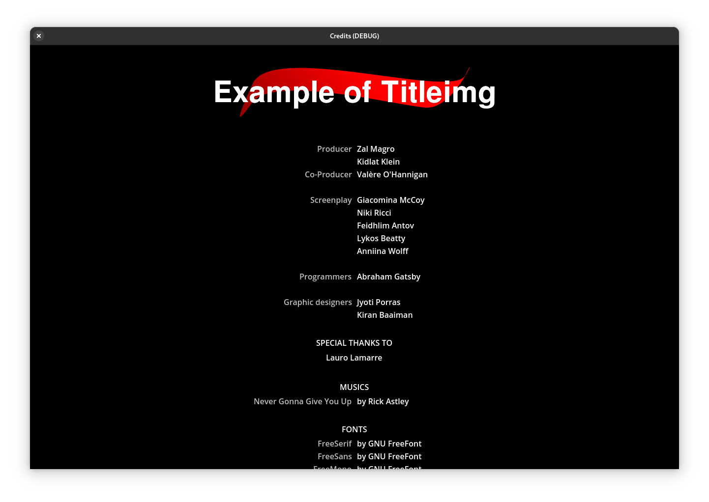
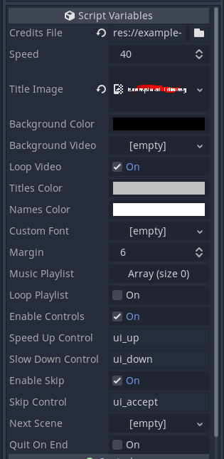

# Credits scroll scene

Credits scroll scene rich of options (for Godot Game Engine).

# Usage

The credits file must be provided in a INI like format, 
example:

```
[Programmers]
Programmer's name
Another programmer's name
```

An example file is provided at example-CREDITS.

Load the scene, set the credits file and you are ready to go. 
All the options available al pretty much clear on what each do.

# Features

- Centered titles and double panel titles
- Signal on scroll end
- Customizable speed
- Set an image as title
- Customizable colors
- Video as background (with optionable loop)
- Customizable font
- Customizable margins
- Music playlist (with optionable loop)
- Optionable controls for speed, stop and reverse at gamers reach
- Optionable skip control
- Optionable scene to load on scroll end
- Optionable quit on scroll end

# Screenshots



<video style="width:100%" autoplay loop controls>
	<source src="screenshots/scrolling.mp4" type="video/mp4">
</video>
[scrolling.mp4](screenshots/scrolling.mp4)



# LICENSE

[LICENSE](LICENSE)
